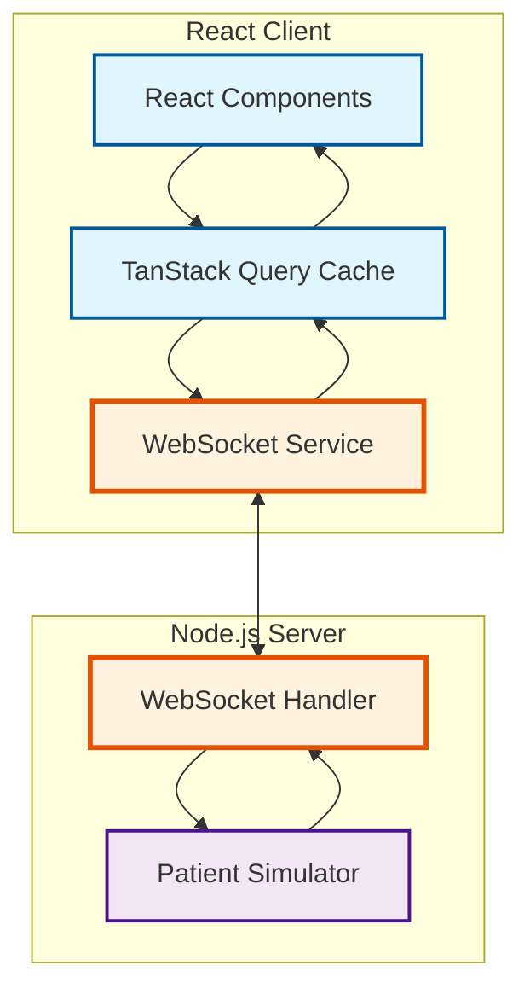
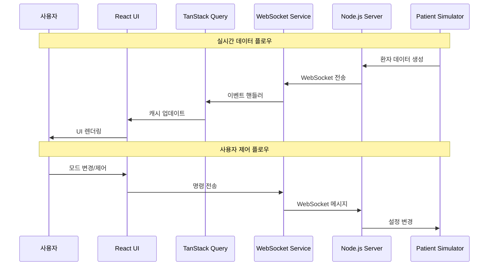

# Delta Test - WebSocket 성능 측정 프로젝트

실시간 데이터 업데이트 전략에 따른 성능 측정

## 🎯 프로젝트 개요

회사에서 만들고 있는 실시간 데이터 동기화 기능 중, 통신 포맷 전략에 따른 **네트워크 효율성**, **클라이언트 성능**, **사용자 경험**을 종합적으로 비교 측정하는 시스템입니다.

### ✨ 주요 특징
- 🔄 **3가지 데이터 전송 전략** (Full, Delta, Hybrid)
- 📊 **실시간 성능 모니터링** 및 메트릭 대시보드
- 🔍 **Raw 메시지 로깅** 및 분석 도구
- ⏸️ **일시정지/재개** 기능으로 세밀한 테스트 제어
- 🔄 **스마트 초기화** - 연결 상태 무관 데이터 리셋
- 📱 **반응형 UI** - 한 화면에 100명 환자 표시 가능

## 🏗️ 기술 스택

### Frontend
- **Vite** + **React 18**
- **TanStack Query (react-query)**
- **Tailwind CSS**
- **Recharts** - 실시간 차트 및 시각화
- **Lucide React** - 아이콘 라이브러리

### Backend
- **Node.js** + **Express**
- **WebSocket**
- **UUID**

## 🏛️ 시스템 아키텍처

### 전체 구조



### 데이터 플로우


### 아키텍처 패턴

#### **1. 실시간 상태 동기화**


- **WebSocket Service**: 실시간 양방향 통신
- **Custom Hooks**: WebSocket 이벤트를 React Query와 연결
- **TanStack Query**: 서버 상태 캐싱 및 동기화
- **React Components**: 자동 리렌더링 및 사용자 인터페이스

#### **2. 상태 관리 계층**
```
┌─────────────────────────────────────────┐
│              UI Layer                   │ ← React Components
├─────────────────────────────────────────┤
│           State Layer                   │ ← TanStack Query Cache
├─────────────────────────────────────────┤
│         Service Layer                   │ ← WebSocket Service
├─────────────────────────────────────────┤
│          Network Layer                  │ ← WebSocket Connection
└─────────────────────────────────────────┘
```

#### **3. 메시지 처리 플로우**
```
서버 → WebSocket → Service → Hook → Query Cache → Component
  ↓        ↓         ↓       ↓         ↓           ↓
Patient  Message   Event   State    Cache       UI
Data    Received  Handler  Update   Update    Render
```

### 핵심 설계 원칙

#### **🔄 실시간 동기화**
- WebSocket을 통한 즉시 데이터 전파
- TanStack Query로 자동 UI 업데이트
- 클라이언트별 독립적인 상태 관리

#### **📦 캐싱 전략**
```javascript
// TanStack Query 캐시 설정
const patientsQuery = useQuery({
  queryKey: ['patients'],
  enabled: false,        // WebSocket으로만 업데이트
  staleTime: Infinity,   // 실시간 데이터는 항상 fresh
});
```

#### **🎯 이벤트 기반 아키텍처**
```javascript
// WebSocket 이벤트 → Query Cache 업데이트
wsService.on('delta_update', (data) => {
  const currentData = queryClient.getQueryData(['patients']);
  const updatedData = applyDeltaUpdates(currentData, data.changes);
  queryClient.setQueryData(['patients'], updatedData);
});
```

### 확장성 고려사항

#### **수평 확장**
- 클라이언트별 독립적인 WebSocket 연결
- 서버 상태와 클라이언트 캐시 분리
- RESTful API와 WebSocket 하이브리드 지원

#### **모니터링 & 디버깅**
- React Query DevTools 통합
- 실시간 메시지 로깅
- 성능 메트릭 수집 및 시각화

## 📊 데이터 전송 전략 비교

### 0. 공통사항

```
📦 Initial Data 크기(Demo): 약 200KB
⏰ 전송 주기: 5초마다
```

### 1. 🔵 Full Data (항상 전체 스냅샷 전송)
```
📦 데이터 크기(Demo): 약 42KB
🎯 특징: 단순한 구현, 완전한 데이터 일관성 필요
```
- ✅ **장점**: 구현 단순, 데이터 무결성 100% 보장
- ❌ **단점**: 네트워크 대역폭 과다 사용

### 2. 🟢 Delta Update (변경분만)
```
📦 데이터 크기(Demo): 약 600-800 byte
🎯 특징: 효율적 대역폭 사용
```
- ✅ **장점**: 네트워크 효율성 90% 이상 개선
- ❌ **단점**: 동기화 복잡성, 누락 가능성

### 3. 🟡 Hybrid (Delta Update + 일부 무결성 포기)
```
📦 데이터 크기(Demo): 전체 Delta Data 약 600-900 byte | 중요 Delta Data 300-500 byte
⏰ 전송 패턴: 전체 Delta / 중요 Delta 격번으로 전송
  ex. 0: 전체, 1: 중요, 2: 전체, ...
🎯 특징: 중요도가 높은 데이터만 무결성 보장. 나머지는 퍼포먼스를 위해 일부 타협
```
- ✅ **장점**: heartRate, spo2 100% 무결성 + 50% 네트워크 절약
- ❌ **단점**: 구현 복잡도 약간 증가

- ⚠️ **주의사항**: 클라이언트 기기가 저사양일 때 사용하기 위함이므로, 전체 데이터를 받아왔을 때 다음 전체 데이터 수신시까지 중요도가 높은 데이터 순으로 순차적으로 랜더링하도록 구현해야 함. 이 데모에서는 네트워크만 나타내고 있음.

## 🏥 확장된 환자 데이터 구조

> 데이터는 테스트를 위한 '예시' 데이터로, 실제 서비스에서 사용되는 데이터와는 전혀 무관함.

```javascript
{
  "P001": {
    // 기본 정보 (BMI 자동계산)
    name: "환자1", age: 45, gender: "M", height: 175, weight: 70, 
    bmi: 22.9, bloodType: "A+",
    
    // 확장된 생체신호 (13개)
    vitals: {
      heartRate: 75, bloodPressure: { systolic: 120, diastolic: 80, meanArterialPressure: 93 },
      spo2: 98, temperature: 36.5, respiratoryRate: 16,
      centralVenousPressure: 5, pulmonaryArterialPressure: { systolic: 25, diastolic: 10 },
      cardiacOutput: 6.2, intracranialPressure: 10, bloodGlucose: 95,
      urinOutput: 1.5, painScore: 3, glasgowComaScale: { eye: 4, verbal: 5, motor: 6, total: 15 }
    },
    
    // 약물 정보 (3-8개 상세)
    medications: [
      { name: "Morphine", dosage: "50mg", route: "IV", frequency: "3회/일", 
        indication: "Pain management", sideEffects: "Drowsiness", ... }
    ],
    
    // 검사 결과 (22개 혈액검사 + 6개 가스분석)
    labResults: {
      bloodWork: { hemoglobin: 14.5, hematocrit: 42, whiteBloodCells: 8.2, ... },
      arterialBloodGas: { ph: 7.40, pco2: 40, po2: 95, hco3: 24, ... }
    },
    
    // 알레르기, 진단, 간병기록, 의사오더, 보험정보 등
    allergies: [...], diagnoses: [...], nursingNotes: [...], 
    orders: [...], emergencyContact: {...}, insurance: {...}
  }
}
```

## 🚀 설치 및 실행

### 1. 프로젝트 설정
```bash
# 프로젝트 클론
git clone https://github.com/EunHyeokJung/delta-test.git
cd delta-test

# 루트에서 모든 의존성 설치
npm run install:all
```

### 2. 서버 실행 옵션

#### A. 개별 실행
```bash
# 백엔드 서버 (포트 8080)
npm run dev:backend

# 프론트엔드 서버 (포트 5173) - 새 터미널
npm run dev:frontend
```

#### B. 동시 실행 (권장)
```bash
# 백엔드 + 프론트엔드 동시 실행
npm run dev
```

### 3. 접속
- **프론트엔드**: http://localhost:5173
- **백엔드 Health Check**: http://localhost:8080/api/health
- **WebSocket**: ws://localhost:8080

## 🎛️ 사용 가이드

### 📱 인터페이스 구성
1. **홈페이지**: 3가지 모드 선택
2. **환자 모니터링**: 실시간 생체신호 (100명까지 한 화면 표시)
3. **성능 대시보드**: 4개 탭으로 구성
   - **개요**: 핵심 성능 지표
   - **네트워크**: 클라이언트/서버 사용량
   - **메시지**: Raw WebSocket 메시지 로깅
   - **성능 비교**: 모드별 특성 분석

### 🔧 제어 기능
- **▶️ 시작/재개**: WebSocket 연결 및 데이터 수신 시작
- **⏸️ 일시정지**: 연결 유지하며 데이터 처리만 중단
- **🔄 초기화**: 모든 데이터 리셋 후 새로운 환자 데이터 생성
- **🔄 모드 전환**: 실시간으로 전송 방식 변경

### 📊 성능 측정 워크플로우
1. **Full 모드 시작** → 5초간 측정 → 42KB 확인
2. **Delta 모드 전환** → 5초간 측정 → 600-800 byte 확인 (95% 절약)
3. **Hybrid 모드 전환** → 10초간 측정 → 패턴 확인:
   - 전체 주기: 600-900 byte
   - 중요 주기: 300-500 byte (약 50% 차이)

## 🔍 실시간 모니터링 기능

### 📈 성능 메트릭
- **네트워크**: 초당 전송량, 총 데이터량, 메시지 빈도
- **런타임**: 실제 데이터 수신 시간 (일시정지 시간 제외)
- **효율성**: 모드별 대역폭 절약률

### 🔍 Raw 메시지 분석
- **실시간 로깅**: 모든 WebSocket 메시지 기록
- **JSON 뷰어**: 펼치기/접기 + 복사 기능
- **크기 표시**: 각 메시지별 바이트 크기
- **필터링**: 데이터/메타데이터 구분

### 📊 시각적 분석
- **실시간 차트**: 네트워크 사용량 트렌드
- **파이 차트**: 메시지 타입별 분포
- **메트릭 카드**: 핵심 지표 실시간 업데이트

## 🔧 개발자 도구

### 🛠️ 디버깅
```javascript
// 브라우저 콘솔에서 확인 가능한 로그
🟢 [WS] 활성 상태 - initial_data 메시지 처리
🔴 [WS] 일시정지 중 - delta_update 메시지 무시
🔄 [client_xxx] Hybrid 전체 주기 - 모든 데이터 전송
🔄 [client_xxx] Hybrid 중요 주기 - heartRate, spo2만 전송
```

### 📡 API 엔드포인트
```
GET  /api/health              서버 상태 확인
GET  /api/metrics             서버 성능 메트릭
WS   set_update_mode          모드 변경 (full/delta/hybrid)
WS   request_full_data        전체 데이터 요청
WS   request_initial_data     초기 데이터 요청 (초기화용)
WS   get_performance_metrics  성능 메트릭 요청
```

## 📊 성능 벤치마크 예상 결과

### 네트워크 효율성
```
Full Data:    42KB × 12회/분 = 504KB/분
Delta:        700byte × 12회/분 = 8.4KB/분  (98% 절약)
Hybrid:       550byte × 12회/분 = 6.6KB/분 (99% 절약)
```

### 클라이언트 부하
```
Full Data:    높음 (매번 30명 환자 전체 재렌더링, 42KB 처리)
Delta:        낮음 (변경된 필드만 업데이트, 700byte 처리)
Hybrid:       낮음 (변경된 필드만 업데이트, 550byte 처리)
```

### 데이터 무결성
```
Full Data:    100% (항상 최신 상태)
Delta:        95%  (네트워크 오류시 동기화 이슈 가능)
Hybrid:       99%  (중요 데이터는 100%, 기타는 최대 10초 지연)
```

## 🚨 문제 해결

### WebSocket 연결 문제
```bash
# 1. 백엔드 서버 상태 확인
curl http://localhost:8080/api/health

# 2. 포트 사용 확인
netstat -an | grep 8080

# 3. 로그 확인
# 브라우저 개발자 도구 > 콘솔 탭
```

### 성능 측정 이상
- **데이터가 업데이트되지 않음**: 일시정지 상태 확인
- **메시지 누락**: 네트워크 탭에서 WebSocket 프레임 확인
- **성능 저하**: React Query DevTools로 캐시 상태 확인

### UI 반응성 문제
- **환자 카드 깜빡임**: 정상 동작 (데이터 변경 애니메이션)
- **느린 렌더링**: 브라우저 Performance 탭에서 프로파일링

## 📄 라이센스

MIT License - 자유롭게 사용, 수정, 배포 가능 
