# Delta Test - WebSocket 성능 측정 프로젝트

실시간 데이터 업데이트 전략에 따른 성능 측정

## 🎯 프로젝트 개요

회사에서 만들고 있는 실시간 데이터 동기화 기능 중, 통신 포맷 전략에 따른 **네트워크 효율성**, **클라이언트 성능**, **사용자 경험**을 종합적으로 비교 측정하는 시스템입니다.

### ✨ 주요 특징
- 🔄 **3가지 데이터 전송 전략** (Full, Delta, Hybrid)
- 📊 **실시간 성능 모니터링** 및 메트릭 대시보드
- 🔍 **Raw 메시지 로깅** 및 분석 도구
- ⏸️ **일시정지/재개** 기능으로 세밀한 테스트 제어
- 🔄 **스마트 초기화** - 연결 상태 무관 데이터 리셋
- 📱 **반응형 UI** - 한 화면에 100명 환자 표시 가능

## 🏗️ 기술 스택

### Frontend
- **Vite** + **React 18**
- **TanStack Query (react-query)**
- **Tailwind CSS**
- **Recharts** - 실시간 차트 및 시각화
- **Lucide React** - 아이콘 라이브러리

### Backend
- **Node.js** + **Express**
- **WebSocket**
- **UUID**

## 🏛️ 시스템 아키텍처

### 전체 구조


### 데이터 플로우

```mermaid
sequenceDiagram
    participant User as 사용자
    participant UI as React UI
    participant TQ as TanStack Query
    participant WS as WebSocket Service
    participant Server as Node.js Server
    participant PS as Patient Simulator
    
    Note over User,PS: 실시간 데이터 플로우
    
    PS->>Server: 환자 데이터 생성
    Server->>WS: WebSocket 전송
    WS->>TQ: 이벤트 핸들러
    TQ->>UI: 캐시 업데이트
    UI->>User: UI 렌더링
    
    Note over User,PS: 사용자 제어 플로우
    
    User->>UI: 모드 변경/제어
    UI->>WS: 명령 전송
    WS->>Server: WebSocket 메시지
    Server->>PS: 설정 변경
```


### 아키텍처 패턴

#### **1. 실시간 상태 동기화**


- **WebSocket Service**: 실시간 양방향 통신
- **Custom Hooks**: WebSocket 이벤트를 React Query와 연결
- **TanStack Query**: 서버 상태 캐싱 및 동기화
- **React Components**: 자동 리렌더링 및 사용자 인터페이스

#### **2. 상태 관리 계층**
```
┌─────────────────────────────────────────┐
│              UI Layer                   │ ← React Components
├─────────────────────────────────────────┤
│           State Layer                   │ ← TanStack Query Cache
├─────────────────────────────────────────┤
│         Service Layer                   │ ← WebSocket Service
├─────────────────────────────────────────┤
│          Network Layer                  │ ← WebSocket Connection
└─────────────────────────────────────────┘
```

#### **3. 메시지 처리 플로우**
```
서버 → WebSocket → Service → Hook → Query Cache → Component
  ↓        ↓         ↓       ↓         ↓           ↓
Patient  Message   Event   State    Cache       UI
Data    Received  Handler  Update   Update    Render
```

### 핵심 설계 원칙

#### **🔄 실시간 동기화**
- WebSocket을 통한 즉시 데이터 전파
- TanStack Query로 자동 UI 업데이트
- 클라이언트별 독립적인 상태 관리

#### **📦 캐싱 전략**
```javascript
// TanStack Query 캐시 설정
const patientsQuery = useQuery({
  queryKey: ['patients'],
  enabled: false,        // WebSocket으로만 업데이트
  staleTime: Infinity,   // 실시간 데이터는 항상 fresh
});
```

#### **🎯 이벤트 기반 아키텍처**
```javascript
// WebSocket 이벤트 → Query Cache 업데이트
wsService.on('delta_update', (data) => {
  const currentData = queryClient.getQueryData(['patients']);
  const updatedData = applyDeltaUpdates(currentData, data.changes);
  queryClient.setQueryData(['patients'], updatedData);
});
```

### 확장성 고려사항

#### **수평 확장**
- 클라이언트별 독립적인 WebSocket 연결
- 서버 상태와 클라이언트 캐시 분리
- RESTful API와 WebSocket 하이브리드 지원

#### **모니터링 & 디버깅**
- React Query DevTools 통합
- 실시간 메시지 로깅
- 성능 메트릭 수집 및 시각화

## 📊 데이터 전송 전략 비교

### 0. 공통사항

```
📦 Initial Data 크기(Demo): 약 200KB
⏰ 전송 주기: 5초마다
```

### 1. 🔵 Full Data (항상 전체 스냅샷 전송)
```
📦 데이터 크기(Demo): 약 42KB
🎯 특징: 단순한 구현, 완전한 데이터 일관성 필요
```
- ✅ **장점**: 구현 단순, 데이터 무결성 100% 보장
- ❌ **단점**: 네트워크 대역폭 과다 사용

### 2. 🟢 Delta Update (변경분만)
```
📦 데이터 크기(Demo): 약 600-800 byte
🎯 특징: 효율적 대역폭 사용
```
- ✅ **장점**: 네트워크 효율성 90% 이상 개선
- ❌ **단점**: 동기화 복잡성, 누락 가능성

### 3. 🟡 Hybrid (Delta Update + 일부 무결성 포기)
```
📦 데이터 크기(Demo): 전체 Delta Data 약 600-900 byte | 중요 Delta Data 300-500 byte
⏰ 전송 패턴: 전체 Delta / 중요 Delta 격번으로 전송
  ex. 0: 전체, 1: 중요, 2: 전체, ...
🎯 특징: 중요도가 높은 데이터만 무결성 보장. 나머지는 퍼포먼스를 위해 일부 타협
```
- ✅ **장점**: heartRate, spo2 100% 무결성 + 50% 네트워크 절약
- ❌ **단점**: 구현 복잡도 약간 증가

- ⚠️ **주의사항**: 클라이언트 기기가 저사양일 때 사용하기 위함이므로, 전체 데이터를 받아왔을 때 다음 전체 데이터 수신시까지 중요도가 높은 데이터 순으로 순차적으로 랜더링하도록 구현해야 함. 이 데모에서는 네트워크만 나타내고 있음.

## 🏥 확장된 환자 데이터 구조

> 데이터는 테스트를 위한 '예시' 데이터로, 실제 서비스에서 사용되는 데이터와는 전혀 무관함.

```javascript
{
  "P001": {
    // 기본 정보 (BMI 자동계산)
    name: "환자1", age: 45, gender: "M", height: 175, weight: 70, 
    bmi: 22.9, bloodType: "A+",
    
    // 확장된 생체신호 (13개)
    vitals: {
      heartRate: 75, bloodPressure: { systolic: 120, diastolic: 80, meanArterialPressure: 93 },
      spo2: 98, temperature: 36.5, respiratoryRate: 16,
      centralVenousPressure: 5, pulmonaryArterialPressure: { systolic: 25, diastolic: 10 },
      cardiacOutput: 6.2, intracranialPressure: 10, bloodGlucose: 95,
      urinOutput: 1.5, painScore: 3, glasgowComaScale: { eye: 4, verbal: 5, motor: 6, total: 15 }
    },
    
    // 약물 정보 (3-8개 상세)
    medications: [
      { name: "Morphine", dosage: "50mg", route: "IV", frequency: "3회/일", 
        indication: "Pain management", sideEffects: "Drowsiness", ... }
    ],
    
    // 검사 결과 (22개 혈액검사 + 6개 가스분석)
    labResults: {
      bloodWork: { hemoglobin: 14.5, hematocrit: 42, whiteBloodCells: 8.2, ... },
      arterialBloodGas: { ph: 7.40, pco2: 40, po2: 95, hco3: 24, ... }
    },
    
    // 알레르기, 진단, 간병기록, 의사오더, 보험정보 등
    allergies: [...], diagnoses: [...], nursingNotes: [...], 
    orders: [...], emergencyContact: {...}, insurance: {...}
  }
}
```

## 🚀 설치 및 실행

### 1. 프로젝트 설정
```bash
# 프로젝트 클론
git clone <repository-url>
cd delta-test

# 루트에서 모든 의존성 설치
npm run install:all
```

### 2. 서버 실행 옵션

#### A. 개별 실행
```bash
# 백엔드 서버 (포트 8080)
npm run dev:backend

# 프론트엔드 서버 (포트 5173) - 새 터미널
npm run dev:frontend
```

#### B. 동시 실행 (권장)
```bash
# 백엔드 + 프론트엔드 동시 실행
npm run dev
```

### 3. 접속
- **프론트엔드**: http://localhost:5173
- **백엔드 Health Check**: http://localhost:8080/api/health
- **WebSocket**: ws://localhost:8080

## 🎛️ 사용 가이드

### 📱 인터페이스 구성
1. **홈페이지**: 3가지 모드 선택
2. **환자 모니터링**: 실시간 생체신호 (100명까지 한 화면 표시)
3. **성능 대시보드**: 4개 탭으로 구성
   - **개요**: 핵심 성능 지표
   - **네트워크**: 클라이언트/서버 사용량
   - **메시지**: Raw WebSocket 메시지 로깅
   - **성능 비교**: 모드별 특성 분석

### 🔧 제어 기능
- **▶️ 시작/재개**: WebSocket 연결 및 데이터 수신 시작
- **⏸️ 일시정지**: 연결 유지하며 데이터 처리만 중단
- **🔄 초기화**: 모든 데이터 리셋 후 새로운 환자 데이터 생성
- **🔄 모드 전환**: 실시간으로 전송 방식 변경

### 📊 성능 측정 워크플로우
1. **Full 모드 시작** → 5초간 측정 → 42KB 확인
2. **Delta 모드 전환** → 5초간 측정 → 600-800 byte 확인 (95% 절약)
3. **Hybrid 모드 전환** → 10초간 측정 → 패턴 확인:
   - 전체 주기: 600-900 byte
   - 중요 주기: 300-500 byte (약 50% 차이)

## 🔍 실시간 모니터링 기능

### 📈 성능 메트릭
- **네트워크**: 초당 전송량, 총 데이터량, 메시지 빈도
- **런타임**: 실제 데이터 수신 시간 (일시정지 시간 제외)
- **효율성**: 모드별 대역폭 절약률

### 🔍 Raw 메시지 분석
- **실시간 로깅**: 모든 WebSocket 메시지 기록
- **JSON 뷰어**: 펼치기/접기 + 복사 기능
- **크기 표시**: 각 메시지별 바이트 크기
- **필터링**: 데이터/메타데이터 구분

### 📊 시각적 분석
- **실시간 차트**: 네트워크 사용량 트렌드
- **파이 차트**: 메시지 타입별 분포
- **메트릭 카드**: 핵심 지표 실시간 업데이트

## 🔧 개발자 도구

### 🛠️ 디버깅
```javascript
// 브라우저 콘솔에서 확인 가능한 로그
🟢 [WS] 활성 상태 - initial_data 메시지 처리
🔴 [WS] 일시정지 중 - delta_update 메시지 무시
🔄 [client_xxx] Hybrid 전체 주기 - 모든 데이터 전송
🔄 [client_xxx] Hybrid 중요 주기 - heartRate, spo2만 전송
```

### 📡 API 엔드포인트
```
GET  /api/health              서버 상태 확인
GET  /api/metrics             서버 성능 메트릭
WS   set_update_mode          모드 변경 (full/delta/hybrid)
WS   request_full_data        전체 데이터 요청
WS   request_initial_data     초기 데이터 요청 (초기화용)
WS   get_performance_metrics  성능 메트릭 요청
```

## 📊 성능 벤치마크 예상 결과

### 네트워크 효율성
```
Full Data:    42KB × 12회/분 = 504KB/분
Delta:        700byte × 12회/분 = 8.4KB/분  (98% 절약)
Hybrid:       550byte × 12회/분 = 6.6KB/분 (99% 절약)
```

### 클라이언트 부하
```
Full Data:    높음 (매번 30명 환자 전체 재렌더링, 42KB 처리)
Delta:        낮음 (변경된 필드만 업데이트, 700byte 처리)
Hybrid:       낮음 (변경된 필드만 업데이트, 550byte 처리)
```

### 데이터 무결성
```
Full Data:    100% (항상 최신 상태)
Delta:        95%  (네트워크 오류시 동기화 이슈 가능)
Hybrid:       99%  (중요 데이터는 100%, 기타는 최대 10초 지연)
```

## 🚨 문제 해결

### WebSocket 연결 문제
```bash
# 1. 백엔드 서버 상태 확인
curl http://localhost:8080/api/health

# 2. 포트 사용 확인
netstat -an | grep 8080

# 3. 로그 확인
# 브라우저 개발자 도구 > 콘솔 탭
```

### 성능 측정 이상
- **데이터가 업데이트되지 않음**: 일시정지 상태 확인
- **메시지 누락**: 네트워크 탭에서 WebSocket 프레임 확인
- **성능 저하**: React Query DevTools로 캐시 상태 확인

### UI 반응성 문제
- **환자 카드 깜빡임**: 정상 동작 (데이터 변경 애니메이션)
- **느린 렌더링**: 브라우저 Performance 탭에서 프로파일링

## 📄 라이센스

MIT License - 자유롭게 사용, 수정, 배포 가능 